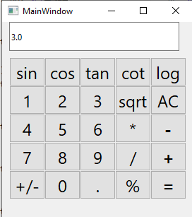

# Calculator App
This App is written by **Python** with using [Pyside6](https://doc.qt.io/qtforpython-6/quickstart.html) Library .

1- installed Pyside6 library.

2- statement "pyside6-designer" was written in Terminal.

3-the calculator was designed in GUI screen.

## main window

