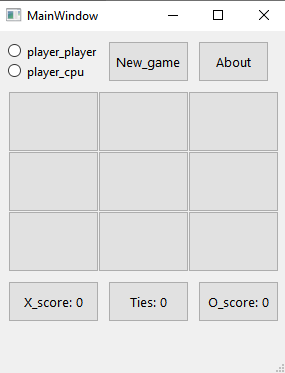

# Tic Tac Toe
is played with two player or player vs cpu
each player chooses their own token - an 'X' or an 'O' - and they take turns filling their own tokens into 3x3 squares. The winner is the one who is the first to place his signs vertically, horizontally or diagonally without empty spaces.

## Game 
this game is written by **Python** using [Pyside6](https://doc.qt.io/qtforpython-6/quickstart.html) 

## main window

