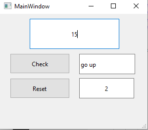

# Guess Number
This App is coded by **Python version 3.10.8** using [Pyside6](https://pypi.org/project/PySide).

## Usage
1- enter your selected number between(0 to 100)   
2- press "check" button and App shows if it needs to "go up" or "go down" or maybe your number is correct